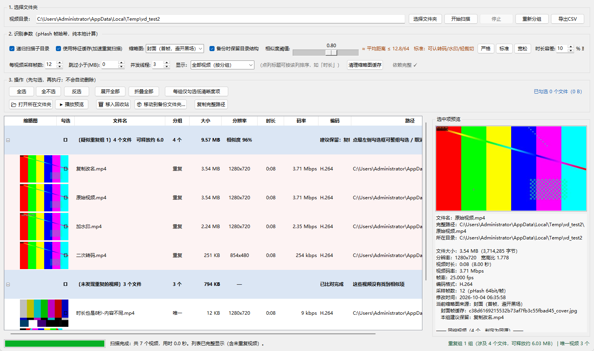
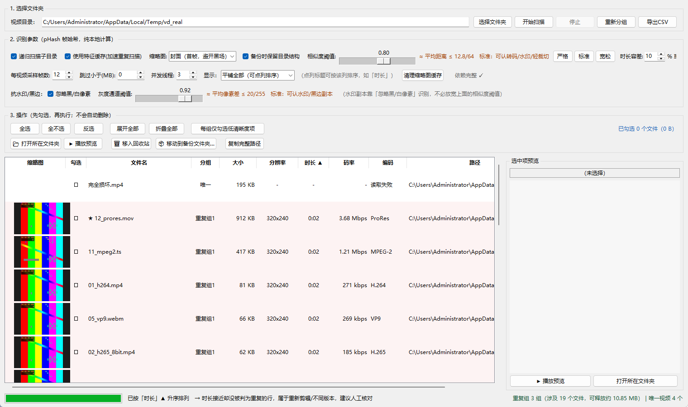

# 本地视频查重小工具 v1.2.2

> ## ⏹ 项目状态：已无限期停止开发
>
> 本工具的功能已经完整（v1.2.1 为收尾版本，修完了发布前全面自查发现的全部问题）。
> **因没有新的具体需求，本项目自 2026-10-05 起无限期停止开发**：不再有新功能。
> v1.2.2 只做**分发形式的修补**（单文件 exe → 文件夹版），算法与功能零改动。
> 仓库保持公开可读，可自由 fork、修改与二次开发（MIT）。
>
> - 本次修复的问题清单 → [`CHANGELOG.md`](CHANGELOG.md)
> - 功能边界、已知取舍与维护状态 → [`docs/PROJECT-STATUS.md`](docs/PROJECT-STATUS.md)

一个纯本地运行的 Windows 视频查重工具：递归扫描文件夹 → 完整列出所有视频 → 用**双通道指纹**自动找出同源视频并分组 → 人工勾选后执行「移入回收站 / 移动到备份文件夹」。

> **隐私硬规则**：全部运算在本机完成。代码中不存在任何网络请求（无 `requests` / `urllib` / `socket` / http 调用），不上传视频或图片、不调用任何云端模型、不联网。
>
> **不需要安装 ffmpeg**：元信息来自 `pymediainfo` 自带的 MediaInfo，解码来自 OpenCV 内置的 FFmpeg。实测可解 H.264 / H.265(8bit+10bit) / VP9 / AV1 / Xvid / MJPEG / WMV2 / MPEG-2 / FLV / ProRes 等 12 种编码容器，全部成功。

**v1.2.2 变更（只改分发形式，功能零改动）**

- **免安装版从「单文件 exe」改成「文件夹 + 启动器」**（PyInstaller `--onedir`）。单文件版每次双击都要先把约 250 MB 内容解压到临时目录，要等 5~10 秒；文件夹版依赖就摆在旁边，**启动是瞬时的**。同时单文件那种"运行时自解压"的行为在个别杀软的启发式眼里很像释放载荷的木马，换成分发文件夹后这个误报面也不存在了。
- 仓库**不再分发单文件 exe**（历史 Release 里的 `VideoDedupTool.exe` 附件已移除）；想自己出单文件版随时可以打，`打包exe.bat` 里留了现成命令。
- 源码改动仅一处版本号字符串 —— 算法、参数、判定逻辑与 v1.2.1 完全一致。

**v1.2.1 修复（收尾版本，问题全部来自发布前全面自查）**

- **修：命令行结果不可复现**。同一目录、同一参数连跑多次，"建议保留"会在两个**字节完全相同**的副本之间来回跳（实测 3 次跑出 2 种结果）。原因是命令行用 `as_completed` 收集结果，候选顺序随线程完成次序变化，而质量判据最后一级在数值相等时取"先遇到的"。现已固定按路径排序 + 确定化平局裁决：同输入必得同输出，命令行与界面也指向同一个文件。
- **修：「重新分组」忽略灰度通道设置**。「灰度通道阈值」滑杆与「忽略黑/白像素」开关此前只在"开始扫描"时生效，点"重新分组"（以及移入回收站/备份后的自动重分组）会被静默忽略，与文档说法不符。现已一并传入；勾选框改动后立即重新分组。
- **修：对话框未设置父窗口**（18 处）。少数窗口环境下消息框会落到主窗口之后，主界面看起来像死机。现已全部指定父窗口。
- **修：自检对抗水印的结论过于乐观**。原自检只用"不透明纯白块"水印，会得出"掩码让相似度从 95% 回到 99.96%"的乐观结论；现新增**半透明台标**用例（贴近真实平台水印）。实测该场景掩码增益只有 +0.5pp —— 半透明水印合成后既不到近白也不到近黑，**掩码排除不到它，真正把它认出来的是 32×32 灰度通道本身**。文档口径已按此修正（见 §3）。
- **修：4 个参数存了不读**。时长容差、采样帧数、跳过小于(MB)、上次备份目录此前每次启动都被重置为默认值，现已正确读回。
- **修：缩略图缓存版本号未跟随主缓存版本升级**；清理一处重复的异常分支。
- **修：文档与实现不一致**（下载包版本号仍写 v1.1、自检项数写错、文件表重复一行），并新增 `CHANGELOG.md` 与发布校验清单输出。

**v1.2 新增**

- **抗水印的「灰度掩码通道」**（核心改进）：不再靠"放宽阈值"来认水印副本，而是把**近黑（≤32）/ 近白（≥240）像素排除在计分之外**——水印、黑边、烧制字幕直接不参与比对，画面主体仍严格比对。两个通道（pHash / 灰度掩码）**任一命中即判重**。实测：把阈值收紧到 0.92（严到平均汉明距离 ≤5.1/64）时，带水印副本的 pHash 只有 86.6% 已不达标，**仍被掩码通道捞回**，而完全无关的视频不会被误判。
- **组代表互验，防止"连环并组"**：合并两个分组前先验证两组各自的代表文件是否互相相似。此前 A~B、B~C 会把 A、C 也连成一组（纯并查集的传递性），在"同系列不同集""同博主不同视频"的目录里会把整个目录并成一个巨大的假组。
- **「建议保留」改用逐级淘汰 + 近似平局容差**：判据顺序 `时长 → 分辨率 → 每像素位数 → 码率 → 帧率 → 文件大小`，每级只在上一步打平的候选里继续比，并带容差。旧版用固定三元组排序，会出现"200 kbps 的 1080p 糊片"压过"8 Mbps 的 720p 高清"。界面会显示**理由**（如"建议保留：xxx.mp4（时长更长）"）。
- **免安装 exe**：已打包验证，无需安装 Python 与任何依赖，双击即用（见 §7）。
- 修复：编码名显示成数字（FLV 的 H.264 曾显示为「7」、MPEG-TS 的 MPEG-2 显示为「2」）；中文 Windows 控制台下打包版会因 `✓` 字符崩溃（GBK 编不出来）。
- 抽帧自适应：短视频用顺序 `grab()`、长视频用逐位置 seek（实测 30 秒视频快 2.1×、5 分钟视频快 4.2×），两条路取到的帧**完全一致**。

**v1.1 新增**
- **缩略图来源下拉框**：封面（首帧，自动避开黑场）/ 内容帧（1/4 处）/ 中间帧（1/2 处）/ 不显示。**封面帧适合直接肉眼比对同源关系**（实测同源封面 pHash 距离约 2，异源约 30）。
- **所有列可点击排序**：时长 / 大小 / 分辨率 / 码率 / 文件名 / 路径 / 分组，再次点击切换升降序；新增「平铺全部」视图，可按时长排列、快速定位时长几乎一致的可疑项。

---

## 界面预览

**① 主界面 —— 疑似重复视频自动分组**
左列缩略图取的是「封面帧」（视频首帧，自动避开黑场）：同源视频的封面几乎一模一样，一眼就能看出是一份东西。
右侧面板显示选中视频的完整信息，并列出同组视频及其与本行的相似度。



**② 平铺视图 + 点「时长」列排序**
点任意列标题即可按该列排序（再次点击切换升降序，标题显示 ▲/▼）。切到「平铺全部」后排序效果最直观——时长接近的视频会排在一起，方便辅助核对。
文件名前的 `★` 是该组建议保留项（分辨率 × 码率最高），排序后依然能认出来。



---

## 1. 快速开始

```
# 1) 安装依赖（双击也行）
安装依赖.bat

# 2) 启动（双击也行）
运行工具.bat
```

或手动执行：

```bat
pip install -r requirements.txt
python video_dedup.py
```

> 也可以直接下载打包好的压缩包：**[Releases](https://github.com/tmadmao/videodedup/releases/latest)** → `videodedup-v1.2.2.zip`（源码 + 文档 + 启动脚本，解压即用，同样是双击 bat）；不想装 Python 就直接下同页的 `VideoDedupTool-v1.2.2-win64.zip`（解压后双击文件夹里的 exe）。

环境要求：Windows + Python 3.8 以上（官方安装包自带 tkinter）。
建议 `ffmpeg` 在 PATH 中（缺失时仍可运行，只是元信息读取兜底方案少一层）。

启动后可以先做一个环境与算法自检：

```bat
python video_dedup.py --selftest
```

---

## 2. 界面说明

### 区 1：选择文件夹
| 按钮 | 作用 |
| --- | --- |
| 选择文件夹 | 选择要扫描的目录 |
| 开始扫描 | 递归扫描 + 抽帧哈希 + 自动分组 |
| 停止 | 中断扫描（已完成的文件保留） |
| 重新分组 | **不重新计算哈希**，仅按当前阈值/容差重新分组（调参后秒出结果） |
| 导出CSV | 导出全部视频清单（UTF-8-BOM，Excel 直接打开不乱码） |

### 区 2：识别参数

| 参数 | 默认 | 说明 |
| --- | --- | --- |
| 递归扫描子目录 | 开 | 关掉只扫当前目录 |
| 使用特征缓存 | 开 | 缓存 "路径+大小+修改时间 → 哈希"，二次扫描几乎瞬时；文件被改动会自动失效重算 |
| **缩略图** | 封面（首帧） | 见下方「缩略图来源」；切换后**立即生效，不需要重新扫描** |
| 备份时保留目录结构 | 开 | 备份时按原目录层级摆放 |
| 相似度阈值 | **0.80** | 见下节「阈值怎么定」；配 严格 / 标准 / 宽松 一键预设 |
| 时长容差 | 10% 或 5 秒 | 两个视频时长差异超过它就不做比对（防误判），取"比例"和"秒数"中较宽的一个 |
| 每视频采样帧数 | 12 | 沿着视频均匀抽帧做哈希。调高更稳、更慢 |
| 跳过小于(MB) | 0 | 过滤掉碎小文件 |
| 并发线程 | CPU核数/2（2~6） | 抽帧解码是 CPU 密集的，机械硬盘不建议超过 6 |
| **显示** | 全部视频（按分组） | 可切换 `仅重复组`、`平铺全部（可点列排序）` |

### 缩略图来源（v1.1 新增）

| 选项 | 取帧位置 | 用途 |
| --- | --- | --- |
| **封面（首帧，避开黑场）** | 第 0 帧；若为黑场/纯色则自动向后试探（最远到 40% 处） | **判断"是不是同一来源"最快**：同源视频封面几乎一模一样 |
| 内容帧（1/4 处） | 视频 25% 位置 | 看画面内容，但不同视频取帧时间点不同，不适合直接比对 |
| 中间帧（1/2 处） | 视频 50% 位置 | 同上 |
| 不显示缩略图 | — | 视频数量很大时提升滚动流畅度 |

> 为什么"内容帧不能用来比对"：同一段视频的不同副本，如果编码/剪辑略有差异，抽到的第 12 帧可能落在不同画面上，人眼看着就不一样；而**封面帧（尤其是首帧）几乎总是一致的**。
> 实测：原始视频 vs 复制改名 / 二次转码 / 加水印，封面 pHash 距离分别是 0 / 2 / 4；而无关视频是 28~32。
> 三种缩略图在扫描时**一次性全部生成**（各存一张 JPEG），所以下拉框切换是瞬时的。

### 排序（v1.1 新增）

- **点任意列标题即可按该列排序**，同一列再点一次切换升/降序，标题上会显示 `▲` / `▼`。
- 在**分组视图**下：组内按该列排序，组之间也按该列排序（升序取组内最小值、降序取最大值），所以"数值接近的行"会彼此相邻。
- 在**平铺全部**视图下：全部视频在同一层，排序效果最直观——**点「时长」就能把时长接近的视频排在一起**。
- 排序后"建议保留项"会以 `★` 前缀标在文件名前，组标题行也会写明 `建议保留：xxx.mp4`，不会因为排序而看不清该留哪个。
- **关于按时长排序的用法**：时长一致只是"可疑线索"，不是判重依据。例如同一段内容被重新剪辑、加长片头片尾，时长会不同但 pHash 仍能认出；反过来，两个时长完全相同、但内容毫不相关的视频（实测就是如此），pHash 会正确地把它们判为"唯一"。所以：**按时长排序用来找线索，最终结论仍然看缩略图与分组结果。**

### 区 3：操作（**只允许人工勾选后执行，绝不自动删除**）
- **勾选框在列表最左侧**：点单个文件的 ☐ 勾选它；点**分组标题行的 ☐ 可整组勾选/取消**；`空格` 切换当前选中行。
- `每组仅勾选低清晰度项`：每个重复组自动勾上「除第一项（分辨率×码率最高、建议保留）以外的全部」——这是**辅助勾选**，执行前仍需你自己确认。
- 单个/批量操作：`📂 打开所在文件夹`、`▶ 播放预览`、`🗑 移入回收站`、`📦 移动到备份文件夹…`、`复制完整路径`。
- 右键菜单：勾选本组全部 / 取消本组勾选 / 勾选本组除首个外全部 / 播放 / 打开文件夹 / 回收站 / 备份 / 复制路径。
- **双击某行 = 用系统默认播放器打开该视频**；双击分组标题 = 展开/折叠。
- 右侧预览面板：大图 + 完整元信息 + 同组视频及其与本行的相似度。

---

## 3. 相似度阈值怎么定（实测依据）

用同一段视频做了 5 种"同源变形"的实测。两个通道各自的度量不同，分开列：

| 变形 | pHash 相似度 | 灰度掩码相似度 |
| --- | --- | --- |
| 复制改名（原样拷贝） | 100.0% | 100.0% |
| 二次转码（854×480，CRF 32） | 98.4% | 99.6% |
| 轻微裁切（裁边后放大回原尺寸） | 92.5% | 97.7% |
| 加水印（角标 + 半透明底框） | **86.6%** | **99.0%** |
| **完全无关的另一个视频** | 52.1% | 74.9% |

注意最后两行：**水印把 pHash 相似度压到了 86.6%，但灰度掩码通道仍有 99.0%** —— 这就是"不必放宽 pHash 阈值也能认水印"的原因。异源样本在两个通道上都远低于阈值，中间安全区很宽。

> **关于「掩码」的适用范围（v1.2.1 起如实说明）**：抗水印的主力是**灰度通道本身**（把每帧压成 32×32 灰度后逐像素比对），**不是掩码**。掩码（忽略近黑 ≤32 / 近白 ≥240 像素）真正能帮上忙的是**黑边、纯白台标、烧制白字幕**这类"贴近纯黑纯白"的干扰；对最常见的**半透明水印**（白字 + 半透明黑底）它几乎没有增益——合成后这些像素既不到 240 也不低于 32，掩码排除不到它们。实测：不透明纯白块水印上掩码把相似度从 95.16% 提到 99.96%（+4.8pp），而半透明台标只有 +0.5pp；并且掩码会**抬高异源相似度**（实测 66.1% → 74.9%），略微压缩安全区。`--selftest` 现在两种情况都会测。

默认值：

- **pHash 通道 0.80（标准）** → 允许平均汉明距离 ≤ 12.8；
- **灰度掩码通道 0.92** → 允许平均逐像素差 ≤ 20/255（与同类开源工具的默认值一致）；
- **严格 0.92** → 只认"几乎一模一样 + 轻度转码"，此时**水印副本仍由灰度通道兜住**（已实测）；
- **宽松 0.72** → 更灵敏，可能把同系列、同场景的视频也拉进同一组，需要人工复核。

另外三个抗干扰设计已内置：
1. **相对位置对齐 + ±1 帧容差**：转码/裁剪导致帧数和时长轻微变化也能比。
2. **截尾平均**：丢掉约 20% 差异最大的采样帧，这样"片头不同""个别场景切换帧带水印"不会把整段判死。
3. **有效像素下限**：某个采样位置若"非黑非白"的像素不足 25%，该位置**弃权**、交给 pHash 通道判断。
   这是必要的保守设计——有效像素太少时比对结果没有统计意义（开发中实测踩过：大片纯黑的画面扣除黑色后只剩 6% 有效像素，结果把两个完全不同的视频判成 99.9% 相似）。25% 不会误伤真实视频：宽银幕黑边后画面仍占约 76%，暗场景通常也有 40% 以上。

调完阈值点 **重新分组** 即可，无需重新扫描（v1.2.1 起，"重新分组"会一并采用当前的**灰度通道阈值**与**「忽略黑/白像素」**设置）。界面上的「忽略黑/白像素」开关改动后会立即重新分组，可用来做对照。

---

## 4. 命令行模式（批量 / 无人值守，同样纯本地）

```bat
:: 扫描并输出报告
python video_dedup.py --scan "D:\视频库" --out 报告.json --csv 报告.csv

:: 调整灵敏度
python video_dedup.py --scan "D:\视频库" --threshold 0.85 --tol 8 --tol-sec 3

:: 只扫当前目录、跳过小于 20MB、8 线程、每视频采 16 帧
python video_dedup.py --scan "D:\视频库" --no-recursive --min-size 20 --workers 8 --sample 16
```

| 参数 | 说明 |
| --- | --- |
| `--scan 目录` | 必填，要扫描的目录 |
| `--out X.json` / `--csv X.csv` | 输出分组结果（JSON）/ 全量清单（CSV） |
| `--threshold 0.80` | pHash 通道相似度阈值 |
| `--gray-threshold 0.92` | 灰度掩码通道阈值（抗水印） |
| `--no-mask` | 关闭「忽略黑/白像素」掩码（默认开启） |
| `--tol 10` / `--tol-sec 5` | 时长容差（百分比 / 秒） |
| `--sample 12` | 每视频采样帧数 |
| `--min-size 0` / `--workers 4` | 最小文件大小(MB) / 并发线程 |
| `--no-recursive` / `--no-cache` | 不递归 / 不用缓存 |
| `--selftest` | 环境 + 算法自检（含掩码有效性校验） |

命令行输出会打印**命中通道统计**（多少对靠 pHash、多少对靠灰度掩码），便于判断掩码是否在起作用。

---

## 5. 文件说明

| 文件 | 说明 |
| --- | --- |
| `video_dedup.py` | 主程序（GUI + 命令行 + 自检），单文件、带中文注释 |
| `requirements.txt` | 依赖清单 |
| `安装依赖.bat` / `运行工具.bat` / `打包exe.bat` | Windows 双击即用（装依赖 / 启动 / 打包免安装**文件夹版** + 自动压发布 zip） |
| `docs/` | 界面截图（主界面分组视图 / 平铺视图按时长排序） |
| `tools/make_testdata.py` | 生成合成测试样本（同源变体 / 12 种编码 / 连环并组 / 损坏文件） |
| `tools/gui_smoketest.py` | GUI 回归测试（26 项检查）。**会打开窗口，请在桌面会话下运行** |
| `tools/bench_decode.py` + `bench_decode_verify.py` | 抽帧后端性能基准与**取帧准确性**复核 |
| `tools/make_release_zip.py` | 把 onedir 打包产物压成发布用 `VideoDedupTool-v1.2.2-win64.zip` |
| `tools/build_release_zip.py` / `gh_release.py` | 打源码发布包 / 发布到 GitHub Release |
| `CHANGELOG.md` | 更新日志（含 v1.2.1 修复的完整 BUG 清单） |
| `docs/PROJECT-STATUS.md` | 项目状态：功能边界、已知取舍与停止开发说明 |
| `LICENSE` | MIT 开源协议 |

运行期产生的本地文件（都在本机，可随时删除）：

| 路径 | 用途 |
| --- | --- |
| `%TEMP%\video_dedup_thumbs\` | 缩略图磁盘缓存，每个视频 3 张（封面 / 内容帧 / 中间帧），界面上有"清理缩略图缓存"按钮 |
| `%USERPROFILE%\.video_dedup_cache.json` | 帧哈希特征缓存，用于二次扫描加速 |
| `%USERPROFILE%\.video_dedup_config.json` | 上次使用的目录与参数（含缩略图来源、显示方式） |

---

## 6. 常见问题

**Q：回收站按钮点不动 / 提示无法移入回收站？**
优先用 `pip install send2trash`。若系统接口被安全软件或权限限制，工具会**弹窗询问**是否改为移动到各文件所在目录下的 `_视频查重回收站\` 文件夹——这只是"移动"，随时可以拖回来，**任何情况下都不会做不可逆的彻底删除**。

**Q：为什么有的视频显示"读取失败"？**
文件损坏，或该编码在 OpenCV 里没有对应解码器（典型如某些 HEVC/AV1/加密流）。这类文件仍会完整列在清单里，只是不参与比对。

**Q：几百个 G 的视频要跑多久？**
瓶颈是解码抽帧。参考：8 秒 720p 视频单文件约 0.4 秒；默认 12 帧/文件、4~6 线程。机械硬盘可适当降低线程数、降低采样帧数、提高"跳过小于(MB)"。二次扫描因为缓存基本是秒级。

**Q：会不会误判？**
pHash 只能判断"画面高度相似"，以下情况容易产生误判，请人工复核：同一系列/同一场景的不同视频、片头片尾很长且相同的不同视频、纯色/静态画面为主的视频、同一视频的不同清晰度版本（这种其实是真重复）。工具只负责**分组建议**，删/移都必须你勾选 + 二次确认。

**Q：大文件/长视频会不会很慢？**
采样帧数与视频时长无关（默认固定 12 帧），所以 10 分钟和 2 小时的视频抽帧成本差不多。封面帧额外最多试探 12 次（正常情况只读 1 次，遇到黑场片头才继续找），开销很小。

**Q：封面缩略图是黑的？**
工具会自动避开"纯黑/纯白/纯色"帧：从第 0 帧开始向后试探（0% → 0.5% → 1% → 2% → 3% → 5% → 7% → 10% → 14% → 20% → 28% → 38%），取第一张有实际画面的帧；若整段视频都很暗，则回退为首帧。自检命令 `python video_dedup.py --selftest` 里包含这一项的验证。

---

## 7. 免安装版（普通用户推荐）

**不想装 Python 的话，直接下载 Releases 里的 `VideoDedupTool-v1.2.2-win64.zip`**——已把所有依赖（Python 运行时、OpenCV、numpy、Pillow、MediaInfo 等）打进文件夹，zip 约 105 MB、解开后约 254 MB：

```
解压 → 双击 VideoDedupTool\VideoDedupTool.exe → 选目录 → 开始扫描
```

> **文件夹版要整体使用**：把 exe 单独拖出来会跑不起来，依赖就在同级的 `_internal\` 里。
> 文件夹与 exe 都可以自由改名（含中文名），比如整个文件夹改成「视频查重」，exe 改成「视频查重工具.exe」。

> **杀软提示**：本软件为自制工具，未做代码签名；所有代码都在本仓库里，可自行查阅核对。
> 若被杀软误报，把整个文件夹加进信任区即可。

自己打包则双击 `打包exe.bat`（会自动打包 + 压成发布用 zip），或手动执行：

```bat
pip install pyinstaller
pyinstaller --onedir --noconsole --name VideoDedupTool ^
            --distpath dist --workpath build --specpath build video_dedup.py
python tools\make_release_zip.py
```

**为什么发文件夹版而不是单文件 exe**（v1.2.2 起）：

| | 单文件 `--onefile` | 文件夹 `--onedir`（现用） |
| --- | --- | --- |
| 启动 | 每次双击先解压约 250 MB 内容到临时目录，等 5~10 秒 | **瞬时**（依赖就在旁边，无需解压） |
| 杀软误报面 | 运行时自解压，行为与"释放载荷的木马"相似 | 无自解压行为，误报面小得多 |
| 分发 | 一个文件，好管理 | 一个 zip / 一个文件夹 |

> 想要单文件 exe 的话可以自己打：把上面的 `--onedir` 换成 `--onefile`、加上 `--noconfirm --clean` 即可（`打包exe.bat` 末尾也留了现成命令）。

关于打包的三点实测经验：

- `pymediainfo` 的 `MediaInfo.dll` 会被 PyInstaller **自动收集**，无需手动指定（冻结后 `pymediainfo: True`，元信息读取正常）。
- **`--noconsole` 下终端符号会踩编码坑**：中文 Windows 的 cmd 默认代码页 936（GBK）里没有 `✓`(U+2713)，一旦输出被重定向到文件，Python 会用 cp936 严格编码并抛 `UnicodeEncodeError` 直接崩溃。程序已修好（启动时 `reconfigure(errors="replace")`、控制台输出只用 ASCII 符号、`--noconsole` 下用空写入器兜住 `print`），并在带参数运行时自动附着父控制台，所以**打包成无控制台版后命令行模式依然可用**。
- 打包后想看 `--selftest` / `--scan` 的输出，在 cmd 里 `cd` 到 exe 所在目录再执行即可（不要直接双击带参数的 exe）。

---

## 8. 许可证

本项目基于 [MIT License](LICENSE) 开源，你可以自由使用、修改、分发（包括商用），只需保留版权声明。

```
Copyright (c) 2026 seanfan
```
